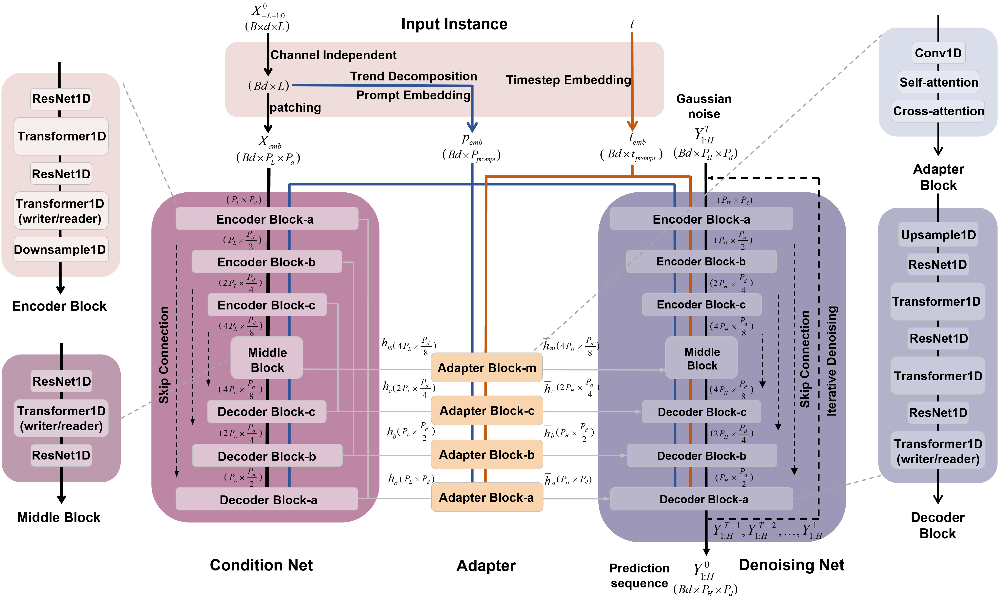
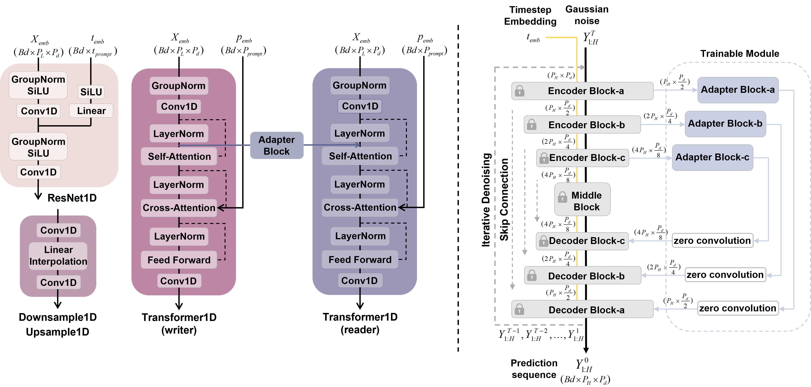
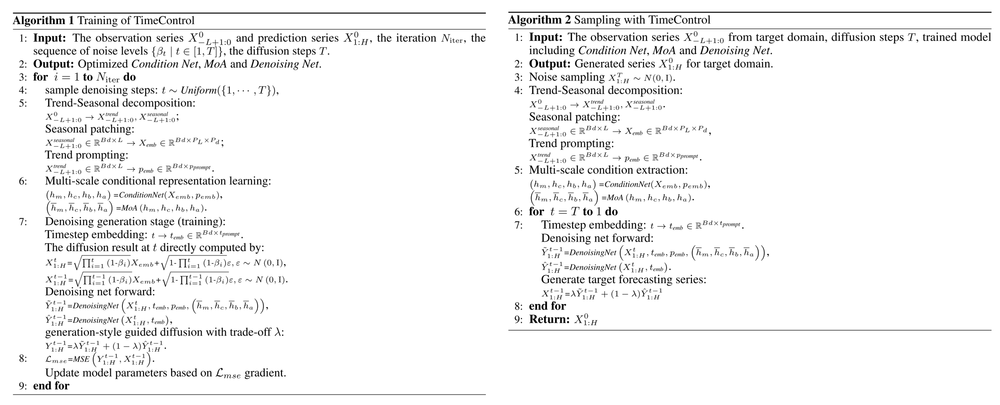
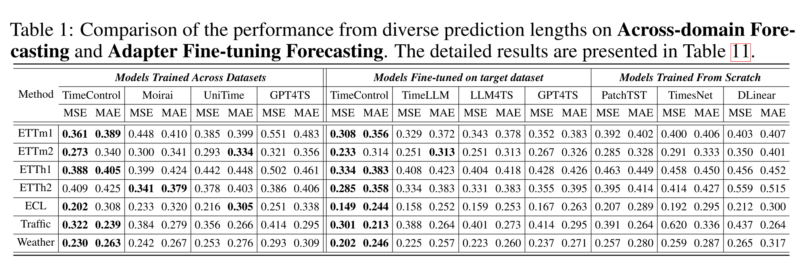
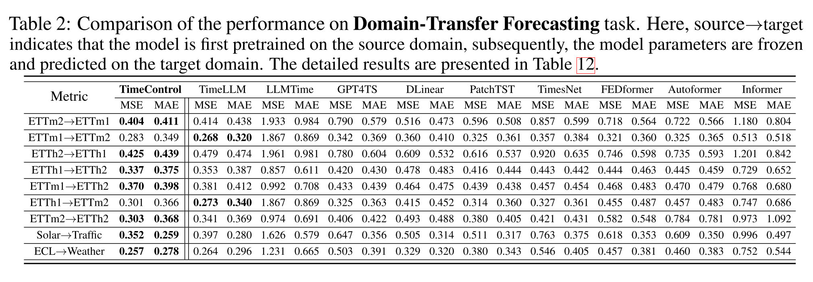
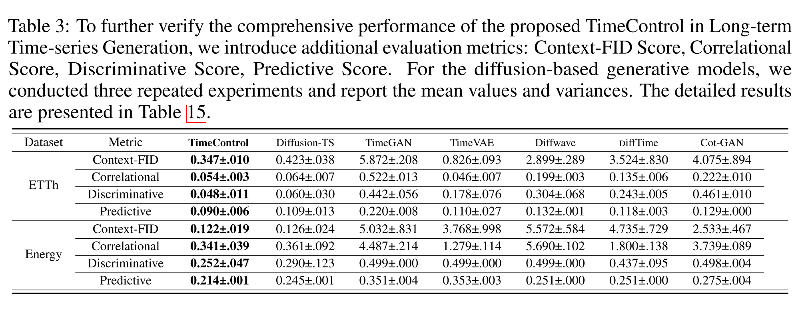
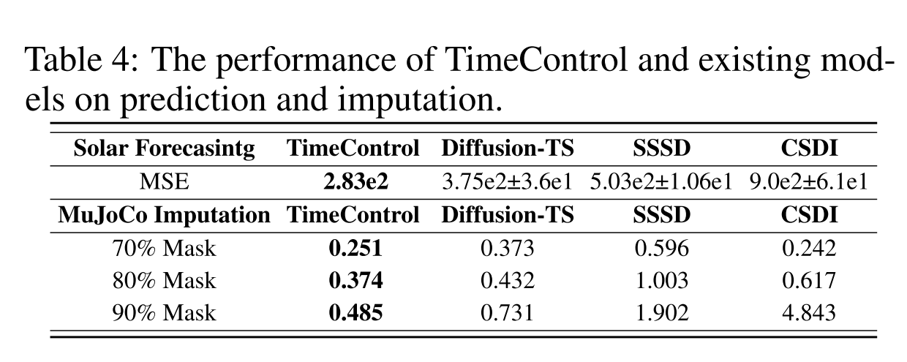

# TimeControl (Submitted to NIPS 2025)

### This is an offical implementation of "TimeControl: Diffusion-based Controllable Generalization for Cross-Domain Time Series Forecasting" submitted to NIPS2025.

We propose TimeControl, the first work to systematically address domain generalization in time series utilizing the diffusion-based framework. TimeControl simultaneously models reverse denoising processes across multiple domains, constructing a common representation space to enable cross-domain generalization. By explicitly controlling the reverse process within a common space, it establishes distinct domain boundaries during the generation phase, ensuring robust and high-quality cross-domain extrapolation.

Surpass existing diffusion-based approaches, TimeControl adopts a two-stage diffusion paradigm that integrates conditional learning and denoising with effective representation understanding and generation modules that clarify domain boundaries. The proposed adapter design supports efficient fine-tuning, preserving pre-trained temporal details and aligning source and target domains for high-quality cross-domain generalization. To the best of our knowledge, this is the first diffusion architecture designed to support multi-domain training and fine-tuning.

:star2: **Multi-scale condition-denoising (MCD)**: The condition network captures the multi-scale fluctuation patterns from the observation sequence, which are utilized as context representations to guide the denoising network to generate the prediction sequence.

:star2: **“Plug-and-play” adapter-based fine-tuning strategy**: The multi-domain universal representation learned in the pretraining stage is utilized for downstream tasks in target domains, and generating prediction sequences of arbitrary lengths with flexibility.

:star2: **Generation-style guidance (GSG)**: This strategy dynamically balances free exploration diversity and target domain style control by input conditions, thereby enhancing control over conditional denoising processes.




### Algorithm for training and sampling of TimeControl



To enhance control over conditional denoising processes, TimeControl employs generation-style guidance (GSG), a technique that simultaneously generates both conditional and unconditional denoising outputs during inference. By linearly interpolating these two outputs with a control coefficient λ, our approach dynamically balances free exploration diversity and target domain style control by input conditions, thereby enhancing cross-domain generalization.

## Results

### Across-domain Forecasting and Adapter Fine-tuning Forecasting



The left part of table shows the results of cross-domain pre-training, which validates the ability of the proposed method to model multi-domain probability distributions. Specifically, the average MSE of the proposed TimeControl is reduced by **14.2%**, **20.1%** and **27.6%** compared to the existing Moirai, UniTime and GPT4TS, respectively.

The right part of table demonstrates the results of fine-tuning on target dataset based on the adapter, the average MSE is reduced by **17.9%**, **18.6%** and **22.4%** compared to the existing TimeLLM, LLM4TS and GPT4TS, which indicates that the effectiveness of the proposed fine-tuning strategy.

### Domain-Transfer Forecasting



### Time Series Generation




The generation metrics Context-FID Score, Correlational Score, Discriminative Score and Predictive Score is reduced by **18.2%**, **16.2%**, **18.5%** and **17.8%** on ETTh dataset compared to the existing DiffusionTS. Besides, compared with DiffusionTS, the average improvement of all indicators of TimeControl on ETTh and Energy datasets is **17.6%** and **8.2%**, respectively.

## Getting Started

1. Install requirements. 

```
pip install -r requirements.txt
```

3. Download data. You can download all the datasets from [Autoformer](https://drive.google.com/drive/folders/1ZOYpTUa82_jCcxIdTmyr0LXQfvaM9vIy). Create a seperate folder ```./dataset``` and put all the csv files in the directory.

4. All the scripts are in the directory ```./scripts```. We provide script files for ```multi-domain training``` and ```training from scratch``` on specified domains. For example, if you want to get the multivariate forecasting results for **ETT** dataset, just run the following command, and you can open ```./result.txt``` to see the results once the training is done:

5. multi-domain training
```
accelerate launch --num_processes=1 train_stage_2.py --mode scratch --config configs/forecasting/Concat/336_96.yaml

accelerate launch --num_processes=1 train_stage_3.py --mode scratch --config configs/forecasting/Concat/336_96.yaml

accelerate launch --num_processes=1 train_stage_2.py --mode scratch --config configs/forecasting/Concat/336_192.yaml

accelerate launch --num_processes=1 train_stage_3.py --mode scratch --config configs/forecasting/Concat/336_192.yaml

accelerate launch --num_processes=1 train_stage_2.py --mode scratch --config configs/forecasting/Concat/336_336.yaml

accelerate launch --num_processes=1 train_stage_3.py --mode scratch --config configs/forecasting/Concat/336_336.yaml

accelerate launch --num_processes=1 train_stage_2.py --mode scratch --config configs/forecasting/Concat/336_720.yaml

accelerate launch --num_processes=1 train_stage_3.py --mode scratch --config configs/forecasting/Concat/336_720.yaml
```

6. training from scratch
```
accelerate launch --num_processes=1 train_stage_2.py --mode scratch --config configs/forecasting/ETTh1/336_96.yaml

accelerate launch --num_processes=1 train_stage_3.py --mode scratch --config configs/forecasting/ETTh1/336_96.yaml

accelerate launch --num_processes=1 train_stage_2.py --mode scratch --config configs/forecasting/ETTh1/336_192.yaml

accelerate launch --num_processes=1 train_stage_3.py --mode scratch --config configs/forecasting/ETTh1/336_192.yaml

accelerate launch --num_processes=1 train_stage_2.py --mode scratch --config configs/forecasting/ETTh1/336_336.yaml

accelerate launch --num_processes=1 train_stage_3.py --mode scratch --config configs/forecasting/ETTh1/336_336.yaml

accelerate launch --num_processes=1 train_stage_2.py --mode scratch --config configs/forecasting/ETTh1/336_720.yaml

accelerate launch --num_processes=1 train_stage_3.py --mode scratch --config configs/forecasting/ETTh1/336_720.yaml
```

7. Evaluate in ETTh1 dataset
```
python -W ignore inference_stage_3.py --mode scratch --config configs/forecasting/ETTh1/336_96.yaml

python -W ignore inference_stage_3.py --mode scratch --config configs/forecasting/ETTh1/336_192.yaml

python -W ignore inference_stage_3.py --mode scratch --config configs/forecasting/ETTh1/336_336.yaml

python -W ignore inference_stage_3.py --mode scratch --config configs/forecasting/ETTh1/336_720.yaml

python -W ignore inference_stage_4.py --mode scratch --config configs/forecasting/ETTh1/336_336.yaml
```

8. Zero-shot forecasting in ETTh1
```
python -W ignore inference_stage_3.py --mode scratch --config configs/zero_shot/ETTh1/336_96.yaml

python -W ignore inference_stage_3.py --mode scratch --config configs/zero_shot/ETTh1/336_192.yaml

python -W ignore inference_stage_3.py --mode scratch --config configs/zero_shot/ETTh1/336_336.yaml

python -W ignore inference_stage_3.py --mode scratch --config configs/zero_shot/ETTh1/336_720.yaml

python -W ignore inference_stage_4.py --mode scratch --config configs/zero_shot/ETTh1/336_336.yaml
```

You can adjust the hyperparameters based on your needs (e.g. different patch length, different look-back windows and backbone modules.). We also provide codes for the baseline models.

## Acknowledgement

## Contact

## Citation

